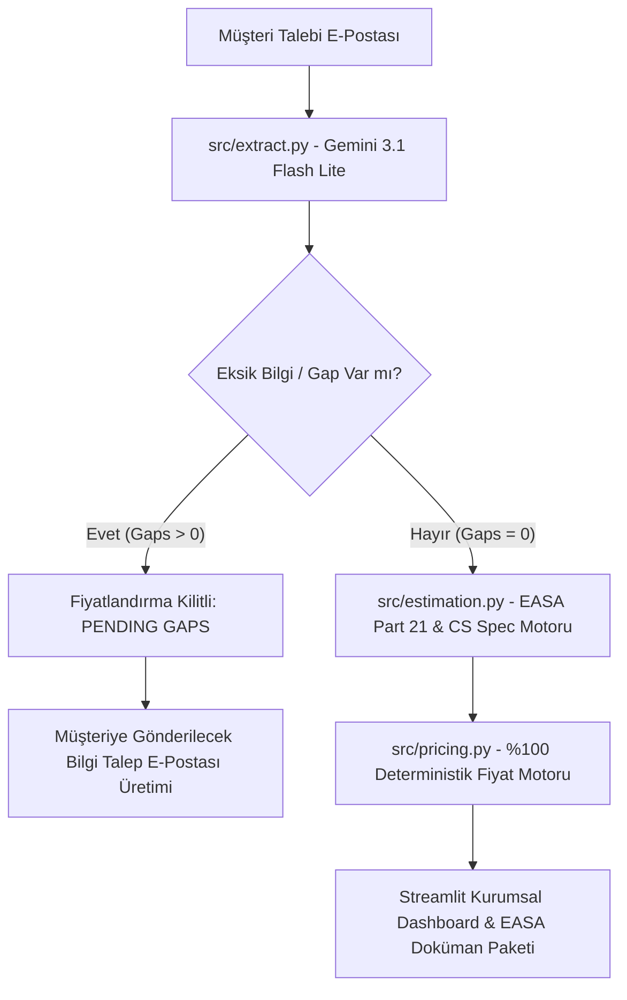

# TEKLİF-Sim v1.1.0 Proje ve Mimari Sunumu
**EASA DOA Uçak Modifikasyon Teklif & Sertifikasyon Simülatörü**

---

## 📌 Slayt 1: Genel Bakış ve Proje Amacı

### **TEKLİF-Sim Nedir?**
TEKLİF-Sim, havacılık **Tasarım Organizasyonu Onayı (DOA - Design Organisation Approval)** ekipleri için geliştirilmiş yapay zeka destekli, bağımsız bir simülasyon ve fiyatlandırma platformudur.

### **Temel İşlevler:**
- **Müşteri Talebi Analizi:** Havayolu müşterilerinden gelen serbest metin e-postaları **Gemini 3.1 Flash Lite** ile analiz eder.
- **Regülasyon Sınıflandırması:** Değişikliğin **EASA Part 21.A.91** (`Minor Change` vs `Major Change / STC`) ve **CS-25 / CS-23** regülasyon durumunu otomatik tespit eder.
- **Eksik Bilgi Denetimi (Gap Detection):** Fiyatlandırma için gerekli 5 zorunlu alanı denetler. Eksik bilgi varsa teklifi kilitler ve müşteriye gönderilecek e-posta taslağını otomatik üretir.
- **%100 Deterministik Fiyatlandırma:** Saf Python fiyatlandırma motoru ile kâr marjı, beklenmedik durum payı, sertifikasyon harçları ve malzeme kalemlerini tam hassasiyetle hesaplar.

---

## 🛡️ Slayt 2: Katı Mühendislik Kuralları ve Güvenlik Guardrail'leri



### **Mimari İlkeler:**
1. **Fiyat Motoru İzolasyonu (`src/pricing.py`):** İçerisinde **hiçbir LLM, rastgele sayı (`random`), ağ çağrısı veya `datetime` kullanılamaz**. AST static analysis testleri ile doğrulanır.
2. **Clean-Room Mühendislik:** Gerçek şirket veya havayolu bilgisi kullanılmaz. Tüm veriler sentetik havayolları (`Flagship Air`, `Anadolu Air`, `Bosphorus Jet`) üzerinden yürütülür.
3. **Test Güvencesi:** 24/24 Otomatik Pytest ve AST Uyumluluk testi %100 başarılıdır.

---

## ✈️ Slayt 3: EASA Part 21 ve Sertifikasyon Motoru (v1.1.0)

### **1. Sabit Kanat Sertifikasyon Şartnamesi (CS Basis):**
- **CS-25:** Büyük Yolcu ve Kargo Taşıma Uçakları (A320, B737, B777, A350, E190 vb.)
- **CS-23:** Genel Havacılık / Küçük Uçaklar (Cessna 172, King Air 350, Diamond DA42 vb.)

### **2. EASA Part 21.A.91 Değişiklik Sınıflandırması:**
- **Minor Change (21.A.91):** Uçağın ağırlık, denge, yapısal dayanım veya operasyonel karakterine belirgin etkisi olmayan değişiklikler.
- **Major Change / STC (21.A.91):** Uçuşa elverişliliği etkileyen büyük modifikasyonlar. **STC (Supplemental Type Certificate)** gerektirir.

### **3. Bağımsız CVE Denetim Saatleri (Part 21.A.239(d)(2)):**
- Proje karmaşıklığına göre bağımsız **CVE (Compliance Verification Engineer - Uyumluluk Doğrulama Mühendisi)** denetim saatleri otomatik tahsis edilir.

### **4. ARP4761 / DO-178C Emniyet Katsayıları:**
- **DAL A / B (Catastrophic/Hazardous):** 2.2x sertifikasyon ve aviyonik saat çarpanı.
- **DAL C / D (Major/Minor):** 1.3x çarpan.
- **DAL E (No Safety Effect):** 1.0x standart çarpan.

---

## 🛠️ Slayt 4: Özel Proje Modülleri ve Adam/Saat Matrisleri

| Proje Modülü | Kapsam ve Teknik Detaylar | Temel Regülasyon Kriteri |
| :--- | :--- | :--- |
| **IFC (Wi-Fi Anten)** | Gövde üstü radome anten montajı, kablo rotalaması, WAP noktaları. | EASA Part 21 Major STC (CS-25) |
| **IFE (Eğlence Sistemleri)** | Koltuk arkası HD ekranlar, sunucu rakı, ARINC 429 haberleşme hattı. | CS-25 Aviyonik & Kabin |
| **ISPS (Koltuk İçi Güç)** | 110V AC / USB-C priz entegrasyonu, Elektrik Yük Analizi (ELAMS). | CS-25 Elektrik Yük Analizi |
| **GAIN (Mutfak Isıtıcıları)** | Mutfak fırınları, kahve ısıtıcıları, şalter paneli modifikasyonu. | CS 25.853 Yanmazlık Testi |
| **ELAMS** | Uçak jeneratör kapasitesi ve elektrik yükü analiz yönetimi. | EASA Part 21 Elektrik Emniyeti |
| **Cabin LOPA** | Kabin içi koltuk konfigürasyon değişimi, PSU ve acil durum ekipman rotalaması. | CS 25.561 / 562 (16g Koltuk Testi) |
| **Structural Repair** | Gövde kaplaması çentik/korozyon tamiri, doubler plate tasarımı. | EASA Part 21 Minor Repair |

---

## 🔒 Slayt 5: Akıllı Fiyat Koruma Mantığı (Gaps-Locked Pricing)

> **Mühendislik İlkesi:** *Teknik kapsam ve uçak bilgileri tam olarak alınmadan hiçbir finansal teklif verilemez!*

```text
[ Müşteri E-Postası ]
         │
         ▼
[ Gap Kontrolü (gaps.py) ]
         │
 ┌───────┴────────────────────────┐
 │ (Eksik Bilgi Var: Gaps > 0)    │ (Eksik Bilgi Yok: Gaps = 0)
 ▼                                ▼
🔒 Fiyatlandırma Kilitlenir      ✅ %100 Deterministik Fiyat Hesabı
   - KPI: PENDING GAPS              - Temel İşçilik Hesabı
   - Sandbox: Kilitli               - Kâr Marjı Bandı
   - E-posta Taslağı Üretilir       - Sertifikasyon Harçları
                                    - İndirilebilir Teklif Özeti (.md)
```

---

## 📄 Slayt 6: Otomatik EASA DOA Doküman Paketi

Oluşturulan her resmi teklif özeti raporunda, EASA Part 21 standartlarına uygun olarak hazırlanacak **DOA Mühendislik Doküman Paketi** otomatik olarak listelenir:

1. **Certification Programme (CP)** & Means of Compliance (MoC)
2. **Service Bulletin (SB)** / Modification Instruction (MI)
3. **Structural / Electrical Substantiation Reports** (Statik & Elektrik Raporları)
4. **Safety Assessment Report** (FHA / PSSA / SSA - ARP4761 uyarınca)
5. **Instructions for Continued Airworthiness (ICA)** / AMM İlavesi
6. **Independent Compliance Verification Statement** (CVE Onay Bildirimi)

---

## 📊 Slayt 7: Sürüm Kontrolü ve Canlı Demo Bilgileri

### **Sürüm ve Etiket Geçmişi:**
- **`v1.0.0` (İlk Temel Sürüm):** Deterministik fiyat motoru ve temel web arayüzü.
- **`v1.1.0` (Mevcut Güncel Sürüm):** EASA Part 21, CS-25/23, ARP4761 emniyet katsayıları, 7 özel proje türü, Gap-Lock fiyat koruması ve 10 sentetik test e-postası.

### **Nasıl Çalıştırılır?**
```bash
# Test Suitini Çalıştırma (24/24 PASS):
.\.venv\Scripts\pytest.exe

# Web Arayüzünü Çalıştırma:
.\.venv\Scripts\streamlit.exe run src/app.py
```

### **Canlı Erişim ve Kod Deposu:**
- **Local Dashboard:** `http://localhost:8501`
- **GitHub Repository:** `https://github.com/selimbilic/teklif-sim.git` (Branch: `main`, Tags: `v1.0.0`, `v1.1.0`)
