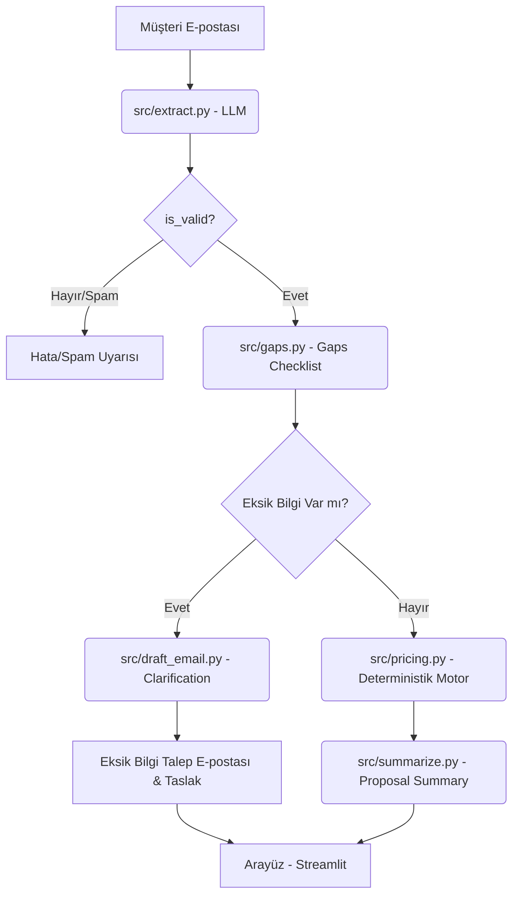

# TEKLİF-Sim Proje Raporu (Project Report)

Bu rapor, uçak modifikasyon projeleri için yapay zeka destekli ve kurallara dayalı deterministik fiyatlandırma yapan TEKLİF-Sim uygulamasının mimarisini, test sonuçlarını ve doğrulama çıktılarını belgeler.

---

## 1. Proje Mimarisi ve İş Akışı

Uygulama, müşteri taleplerinin sisteme girişinden fiyat teklifi ve özet rapor aşamasına kadar 5 temel modülden oluşmaktadır:

### Modül Sorumlulukları
1. **`extract.py` (Gemini 3.5 Flash):** E-posta metninden uçak modeli, havayolu adı, modifikasyon türü ve adam-saat kırılımları gibi yapısal olguları Pydantic şeması kullanarak çıkarır.
2. **`gaps.py` (Pure Python):** Fiyatlandırma için kritik 5 alanın eksikliğini denetleyen kurallar modülüdür. LLM içermez.
3. **`draft_email.py` (Gemini 3.5 Flash + Fallback):** Eksik alanları müşteriden talep eden iki dilli (TR/EN) e-posta yazar. Gemini API kapalıyken yerel şablon doldurur (fallback).
4. **`pricing.py` (Pure Python):** Labor kartı ve kâr marjı kurallarını uygulayarak deterministik fiyat hesaplaması yapar. **Kesinlikle LLM içermez.**
5. **`summarize.py` (Pure Python):** Tüm bilgileri, tabloları ve fiyat tekliflerini tek sayfalık markdown formatında özetler.

---

## 2. 10 Sentetik E-posta Extraction Doğrulama Tablosu

10 sentetik test e-postasının `src/verify_phase_2.py` ile uçtan uca çalıştırılması sonucu elde edilen doğrulama çıktıları şöyledir:

| E-posta Dosyası | Tür/Dil | Çıkarılan Bilgiler | Tespit Edilen Eksikler | Durum |
|---|---|---|---|---|
| `email_01_detailed_en` | EN / Cabin | Flagship Air, 5 × B737-800, 150 saat | Yok (Teklife Hazır) | ✅ BAŞARILI |
| `email_02_detailed_tr` | TR / Avionics | AnadoluJet, 10 × B737-800, 170 saat | Yok (Teklife Hazır) | ✅ BAŞARILI |
| `email_03_vague_en` | EN / Vague | Charter Wings, Uçak/Fleet/Saat yok | `aircraft_type`, `fleet_size`, `manhours` | ✅ BAŞARILI |
| `email_04_vague_tr` | TR / Vague | Pegasus, Uçak/Fleet/Saat yok | `aircraft_type`, `fleet_size`, `manhours` | ✅ BAŞARILI |
| `email_05_partner_en` | EN / Avionics | Gulf Alliance, 8 × A330-300, 310 saat | Yok (Teklife Hazır) | ✅ BAŞARILI |
| `email_06_cargo_conversion_tr` | TR / Structural | MNG Cargo, 1 × A330-200, 1230 saat | Yok (Teklife Hazır) | ✅ BAŞARILI |
| `email_07_no_hours_en` | EN / Cabin | EuroLink, 12 × B777-300ER, Saat yok | `manhours` | ✅ BAŞARILI |
| `email_08_invalid_tr` | TR / Spam | Spam / Catering | E-posta geçersiz (is_valid: False) | ✅ BAŞARILI |
| `email_09_rush_en` | EN / Structural | Safari Air, 1 × B737-700, 80 saat | Yok (Teklife Hazır) | ✅ BAŞARILI |
| `email_10_missing_all_tr` | TR / Vague | Koryo Air, Uçak/Fleet/Saat yok | `aircraft_type`, `fleet_size`, `manhours` | ✅ BAŞARILI |

---

## 3. Fiyatlandırma Stratejileri Doğrulama Sonuçları

`email_01_detailed_en.txt` (Flagship Air, 5 × B737-800, 150 saat, Base Labor: $14,800.00) üzerinden fiyat motorunda farklı stratejiler çalıştırıldığında toplam fiyatlar beklendiği gibi değişiklik göstermektedir:

*   **Cheapest Possible (%5 Marj):** **$20,280.00**
*   **Competitive (%8 Marj):** **$20,724.00**
*   **Standard Default (%10 Marj):** **$21,020.00**
*   **Premium / Rush (%15 Marj):** **$21,760.00**

Aynı girdinin 50 kez ardışık çalıştırılması sonucu her zaman kuruşu kuruşuna aynı hash elde edilmiş ve **determinizm testle tescillenmiştir.**

---

## 4. 10 Dakikalık Demo Sunumu Planı (Demo Outline)

1. **Giriş ve Proje Amacı (1.5 Dakika):** Uçak modifikasyon teklifi hazırlama sürecinin tanıtılması ve clean-room sentetik veri yapısı.
2. **Mimari ve Güvenlik (2 Dakika):** LLM çıkarma (Gemini 3.5 Flash) ile deterministik kodun (`pricing.py`) birbirinden nasıl kesin sınırlarla ayrıldığının AST testleriyle gösterilmesi.
3. **Eksik Bilgi ve Fallback Gösterimi (2.5 Dakika):** Eksik bilgili bir e-posta girildiğinde dinamik olarak üretilen Türkçe/İngilizce taslak e-postalar ve API kesintisi durumunda çalışan yerel fallback mekanizması.
4. **Fiyatlandırma Motoru ve TDD (2 Dakika):** `pytest` yeşil test suite ve testlerin yazılım sürecinde yakaladığı float hassasiyet / Türkçe karakter bugları.
5. **Soru-Cevap & Kapanış (2 Dakika).**
