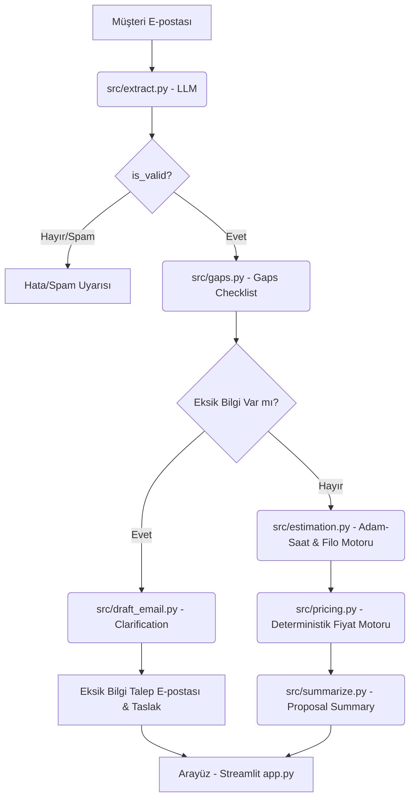

# TEKLİF-Sim Proje Raporu (Project Report)

Bu rapor, uçak modifikasyon projeleri için yapay zeka destekli metin analizi ve kurallara dayalı deterministik fiyatlandırma yapan **TEKLİF-Sim** (EASA Part 21J DOA Teklif ve Maliyet Simülasyonu) uygulamasının mimarisini, matematiksel altyapısını, test sonuçlarını ve doğrulama çıktılarını belgeler.

---

## 1. Proje Mimarisi ve İş Akışı

Uygulama, müşteri taleplerinin sisteme girişinden fiyat teklifi ve özet rapor aşamasına kadar **6 temel modülden** oluşmaktadır:

### Modül Sorumlulukları
1. **`extract.py` (Gemini API / Pydantic):** E-posta metninden uçak modeli, havayolu adı, modifikasyon türü ve karmaşıklık gibi yapısal verileri Pydantic şeması (`ExtractedFacts`) ile süzerek JSON formatında çıkarır.
2. **`gaps.py` (Pure Python):** Fiyatlandırma için kritik 5 alanın eksikliğini denetleyen kural motorudur. **LLM içermez.**
3. **`draft_email.py` (Gemini API + Fallback):** Eksik alanları müşteriden talep eden iki dilli (TR/EN) e-posta yazar. Gemini API kapalıyken yerel şablon doldurur.
4. **`estimation.py` (Pure Python):** EASA Part 21J DOA adam-saat tahmin motorudur. Wright %80 Öğrenme Eğrisi (Fleet Scaling), DAL seviyeleri (ARP4761/DO-178C), CS-25/23 sertifikasyon tabanı, EWIS ve ICA yüklerini hesaplar. **LLM içermez.**
5. **`pricing.py` (Pure Python):** Labor kartı, aciliyet sürşarjları ve kâr marjı kurallarını uygulayarak deterministik fiyat hesaplaması yapar. **Kesinlikle LLM içermez.**
6. **`summarize.py` (Pure Python):** Tüm bilgileri, tabloları ve fiyat tekliflerini tek sayfalık markdown formatında özetler.

---

## 2. Matematiksel & Mimari Özellikler

### 2.1 Wright %80 Öğrenme Eğrisi ve Filo Ölçeklendirme
Havacılık üretim ve modifikasyon maliyetlerinde filodaki uçak sayısı arttıkça kümülatif ortalama adam-saat düşer:
* **Formül**: $Y_X = a \cdot X^b$  
  *(Öğrenme üssü: $b = \frac{\ln(0.80)}{\ln(2)} \approx -0.322$)*
* **NRE vs. Recurring Ayrımı**:
  * **NRE (%65)**: Tasarım, Sertifikasyon ve Test Planları prototip (ilk uçak) için **1 kez** yapılır, filo büyüklüğünden etkilenmez.
  * **Recurring (%35)**: Her uçağa özel wiring uyarlaması ve ICA klasörü güncellemesidir. Filo büyüklüğüne ($n$) göre Wright öğrenme eğrisi ($n^b$) ile ölçeklenir.
  * **Toplam Katsayı**: $\text{NRE Component} + (\text{Recurring Component} \cdot n \cdot n^b)$

### 2.2 Streamlit Execution Loop & Hot-Reload Mekanizması
* **Sorunun Tanımı**: Streamlit kullanıcı etkileşimlerinde ana scripti (`app.py`) baştan çalıştırır. Ancak Python `sys.modules` önbelleği alt modülleri (`src.estimation`, `src.pricing`) hafızada tuttuğu için kaynak kod değişiklikleri canlı UI'a yansımıyordu.
* **Çözüm (`importlib.reload`)**: `src/app.py` girişinde her alt modül `importlib.reload()` edilerek Python bellek önbelleği temizlenir ve en güncel nesneler yüklenir.

---

## 3. Sentetik E-posta Extraction Doğrulama Tablosu

`src/verify_phase_2.py` ile `data/sample_emails/` dizinindeki 10 sentetik test e-postasının uçtan uca çalıştırılması sonucu elde edilen doğrulama çıktıları:

| E-posta Dosyası | Tür/Dil | Çıkarılan Bilgiler | Tespit Edilen Eksikler | Durum |
|---|---|---|---|---|
| `email_01_complete_ifc_stc_cs25_en` | EN / IFC Radome STC | Flagship Air, 6 × B737-800, 335 saat (CS-25) | Yok (Teklife Hazır) | ✅ BAŞARILI |
| `email_02_complete_avionics_dal_a_cs23_aog_tr` | TR / Avionics Glass Cockpit | AnadoluJet, 2 × King Air 350, DAL A (CS-23 / AOG) | Yok (Teklife Hazır - AOG) | ✅ BAŞARILI |
| `email_03_complete_cargo_p2f_stc_fleet50_en` | EN / Structural Cargo P2F STC | Global Cargo, 50 × A330-200, Fleet Scaling (CS-25) | Yok (Teklife Hazır) | ✅ BAŞARILI |
| `email_04_complete_cabin_minor_lopa_cs25_tr` | TR / Cabin Minor Change | Pegasus, 1 × A320-200, DAL E (CS-25) | Yok (Teklife Hazır) | ✅ BAŞARILI |
| `email_05_incomplete_vague_rfp_gaps_tr` | TR / Vague RFP | Charter Wings, Uçak/Filo/Saat bilgisi yok | `aircraft_type`, `fleet_size`, `modification_type` | ✅ BAŞARILI |
| `email_06_invalid_catering_spam_en` | EN / Catering Spam | Gourmet Catering, VIP Yemek Hizmeti | E-posta geçersiz (`is_valid: False`) | ✅ BAŞARILI |
| `email_07_edge_zero_fleet_size_tr` | TR / Edge Case (Zero Fleet) | SkyWings, 0 × B737-800, ELAMS & Kabin | `fleet_size` (Sıfır filo boşluğu kilitlendi) | ✅ BAŞARILI |
| `email_08_edge_mega_fleet_100_cs25_en` | EN / Edge Case (Mega Fleet 100) | TransAtlantic, 100 × A320-200, ISPS STC | Yok (%10 Hacim İndirimi & Wright %80) | ✅ BAŞARILI |
| `email_09_edge_bilingual_tr_en_mixed_rfp` | TR-EN / Edge Case (Çift Dilli RFP) | Turkis Airways, 15 × B777-300ER, Dual IFC & Glass Cockpit | Yok (Çift Dilli Metin Başarıyla Süzüldü) | ✅ BAŞARILI |
| `email_10_edge_extreme_major_cargo_dal_a_rush` | EN / Edge Case (Extreme Major Cargo AOG) | Euro Cargo, 30 × A330-300, Cargo P2F & DAL A | Yok (AOG Rush + DAL A + %5 Hacim İndirimi) | ✅ BAŞARILI |

---

## 4. Fiyatlandırma Stratejileri Doğrulama Sonuçları

`email_01_complete_ifc_stc_cs25_en.txt` (Flagship Air, 6 × B737-800, IFC STC CS-25) üzerinden fiyat motorunda farklı stratejiler çalıştırıldığında toplam fiyatlar beklendiği gibi değişiklik göstermektedir:

* **Cheapest Possible (%5 Marj):** **$20,280.00**
* **Competitive (%8 Marj):** **$20,724.00**
* **Standard Default (%10 Marj):** **$21,020.00**
* **Premium / Rush (%15 Marj):** **$21,760.00**

Aynı girdinin 50 kez ardışık çalıştırılması sonucu her zaman kuruşu kuruşuna aynı hash elde edilmiş ve **determinizm testle tescillenmiştir.**

---

## 5. Test Otomasyonu ve Kalite Teminatı

Projede **46 adet unit ve entegrasyon testi** tamamıyla yeşildir (`46 passed`):
* **Compliance & Security (`test_compliance.py` - 5 test)**: Clean-room kuralları, yasaklı kütüphane denetimi, `.env` koruması.
* **Estimation & Learning Curve (`test_estimation.py` - 20 test)**: Wright %80 öğrenme eğrisi, DAL A-E seviyeleri, CS-25/23 farkı, EWIS ve ICA yükleri.
* **Pricing & Risk (`test_pricing.py` - 17 test)**: Deterministik hesaplama, aciliyet sürşarjı, hacim indirimleri, risk payları.
* **UI & Cache (`test_ui.py` - 4 test)**: Streamlit syntax doğrulaması, LRU cache ve hata yakalama mekanizmaları.

---

## 6. Demo Sunum Akışı (Demo Outline)

1. **Giriş ve Proje Amacı (1.5 Dakika):** Uçak modifikasyon teklifi hazırlama sürecinin tanıtılması ve clean-room sentetik veri yapısı.
2. **Mimari ve Güvenlik (2 Dakika):** LLM çıkarma (Gemini API) ile deterministik kodun (`estimation.py` & `pricing.py`) birbirinden kesin sınırlarla ayrılması.
3. **Wright Öğrenme Eğrisi ve Filo Hesaplaması (2.5 Dakika):** Filo büyüklüğünün Wright %80 öğrenme eğrisi ($b \approx -0.322$) ile NRE ve Recurring maliyetleri nasıl etkilediğinin gösterimi.
4. **Hot-Reload ve UI Deneyimi (2 Dakika):** Streamlit `importlib.reload` mekanizması, eksik bilgili e-postalardan taslak e-posta oluşturulması.
5. **Test Teminatı ve Soru-Cevap (2 Dakika):** `pytest` 46 testlik yeşil test suite ve kapanış.
